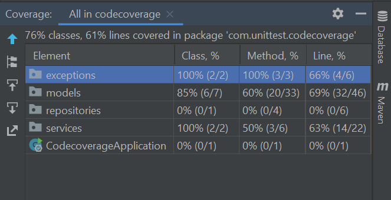
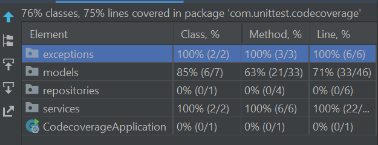
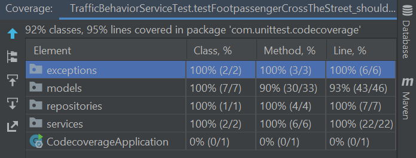
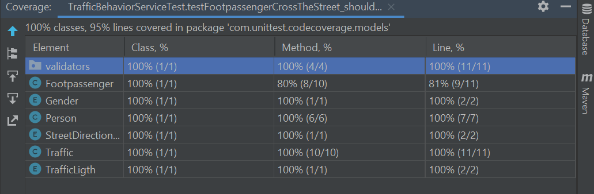
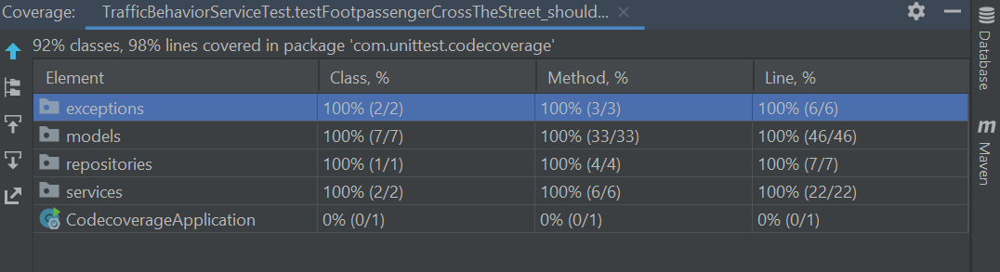
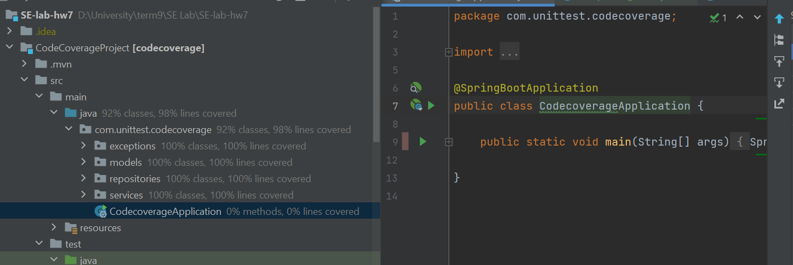
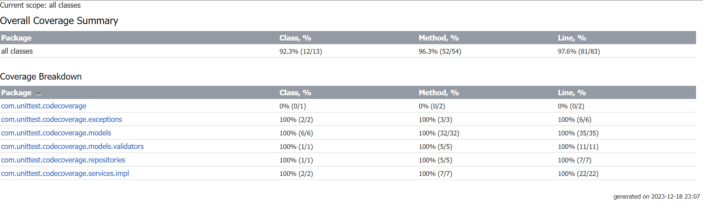
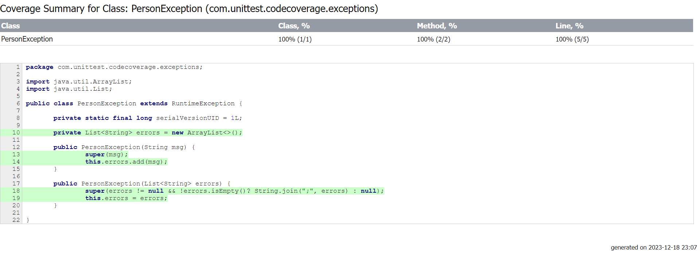

# SE-lab-hw7

مانند گزارش آزمایش، مراحل مربوط به نصب موارد مورد نیاز پروژه را انجام می دهیم. پس از نصب، بر‬ ‫روی‬ ‫پکیج‬ ‫‪java‬‬ ‫در‬ ‫مسیر‬ ‫‪test‬‬ ‫کلیک‬ ‫راست‬ ‫کرده‬ ‫و‬ ‫گزینه ‬‫‪coverage‬‬ ‫‪with‬‬ ‫‪Tests‬‬ ‫‪All‬‬ ‫‪Run‬‬ ‫را‬ ‫انتخاب‬ ‫میکنیم.
.png)


نمونه codecoverage در کلاس PersonException را در تصویر زیر مشاهده میکنید.
.png)

codecoverage دقیق تر به شرح زیر است:


حال به کلاس‌های موجود تست‌های مربوطه را اضافه می‌کنیم تا درصد پوشش را تا حد امکان زیاد کنیم. ابتدا به سراغ کلاس PersonServiceTest می رویم. تست های زیر را اضافه می کنیم.

```java
	@Test
	public void testUpdate_shouldUpdatePersonWithSuccessWhenAllPersonsInfoIsFilled() {
		Person person = new Person();
		person.setName("Name");
		person.setAge(21);
		person.setGender(Gender.F);

		when(repository.insert(any(Person.class))).thenReturn(person);
		service.insert(person);

		person.setName("Name2");
		service.update(person);
		assertEquals(person.getName(), "Name2");
	}

	@Test
	public void testUpdate_shouldThrowPersonExceptionWhenPersonIsNull() {

		List<String> expectedErrors = Lists.newArrayList("Name is required", "Gender is required");
		String expectedMessage = String.join(";", expectedErrors);
		Person person = null;

		assertThatThrownBy(() -> service.update(person))
				.isInstanceOf(PersonException.class)
				.hasFieldOrPropertyWithValue("errors", expectedErrors)
				.hasMessage(expectedMessage);
	}

	@Test
	public void testGet_shouldReturnPersonWhenNameIsProvided() {
		String name = "Name";
		Person person = new Person();
		person.setName(name);
		person.setAge(21);
		person.setGender(Gender.F);

		when(repository.get(any(String.class))).thenReturn(person);

		Person person2 = service.get(name);

		assertEquals(person, person2);
	}

	@Test
	public void testGet_shouldThrowPersonExceptionWhenNameIsNull() {
		String name = null;

		assertThatThrownBy(() -> service.get(name))
				.isInstanceOf(PersonException.class)
				.hasMessage("Name is required");
	}

	@Test
	public void testDelete_shouldDeletePersonWhenNameIsProvided() {
		String name = "Name";

		doNothing().when(repository).delete(any(String.class));

		service.delete(name);
		verify(repository, times(1)).delete(name);
	}

	@Test
	public void testDelete_shouldThrowPersonExceptionWhenNameIsNull() {
		String name = null;

		assertThatThrownBy(() -> service.delete(name))
				.isInstanceOf(PersonException.class)
				.hasMessage("Name is required");
	}
```

حال مشاهده میشود کاورج تست پکیج exceptions 100% می شود.



حال به سراغ کلاس TrafficBehaviorServiceTest می رویم و تستی اضافه میکنیم که حالت درست را پاس کند. 

```java
	@Test
	@DisplayName("Should not throw exception when footpassenger crosses the road safely")
	public void testFootpassengerCrossTheStreet_shouldNotThrowBehaviorExceptionWhenFootpassengerCrossesTheRoadSafely() {

		Traffic currentTrafic = new Traffic();
		currentTrafic.setIntenseCarTraffic(false);

		Footpassenger currentFootpassengerBehavior = new Footpassenger();
		currentFootpassengerBehavior.setCrossedTheRoad(true);
		currentFootpassengerBehavior.setCrossedTrafficLigth(TrafficLigth.GREEN);
		currentFootpassengerBehavior.setLookedToTheLeft(true);
		currentFootpassengerBehavior.setLookedToTheRight(true);

		Assertions.assertThatCode(() -> trafficBehaviorService.footpassengerCrossTheStreet(currentTrafic, currentFootpassengerBehavior))
				.doesNotThrowAnyException();
	}
```
تست کاورج برای models کم است. ابتدا آن را اضافه میکنیم.
```java
public class TrafficTest {

    private Traffic traffic;

    @BeforeEach
    public void setUp() {
        traffic = new Traffic();
    }

    @Test
    public void testCurrentTrafficLight() {
        TrafficLigth expected = TrafficLigth.RED;
        traffic.setCurrentTrafficLight(expected);
        assertEquals(expected, traffic.getCurrentTrafficLight());
    }

    @Test
    public void testIntenseCarTraffic() {
        boolean expected = true;
        traffic.setIntenseCarTraffic(expected);
        assertEquals(expected, traffic.intenseCarTraffic());
    }

    @Test
    public void testMinSpeedAllowed() {
        short expected = 10;
        traffic.setMinSpeedAllowed(expected);
        assertEquals(expected, traffic.getMinSpeedAllowed());
    }

    @Test
    public void testMaxSpeedAllowed() {
        short expected = 20;
        traffic.setMaxSpeedAllowed(expected);
        assertEquals(expected, traffic.getMaxSpeedAllowed());
    }

    @Test
    public void testStreetDirectionFlow() {
        StreetDirectionFlow expected = StreetDirectionFlow.ONE_WAY;
        traffic.setStreetDirectionFlow(expected);
        assertEquals(expected, traffic.getStreetDirectionFlow());
        traffic.setStreetDirectionFlow(StreetDirectionFlow.TWO_WAY);
        assertEquals(StreetDirectionFlow.TWO_WAY,  traffic.getStreetDirectionFlow());
    }
}
```
تست کاورج repositories صفر است. یک کلاس PersonRepositoryTest می سازیم.

```java
public class PersonRepositoryTest {

        private PersonRepository repository;

        @BeforeEach
        public void setUp() {
            repository = new PersonRepository();
        }

        @Test
        public void testInsert_shouldInsertPersonSuccessfully() {
            Person person = new Person();
            person.setName("Name");
            person.setAge(21);
            Person result = repository.insert(person);

            assertEquals(person, result);
        }

        @Test
        public void testInsert_shouldThrowNullPointerExceptionWhenPersonIsNull() {
        assertThrows(NullPointerException.class, () -> repository.insert(null));
    }

    @Test
    public void testGet_shouldGetPersonSuccessfully() {
        String name = "Name";

        Person result = repository.get(name);

        assertNull(result);
    }

    @Test
    public void testGet_shouldThrowNullPointerExceptionWhenNameIsNull() {
        assertThrows(NullPointerException.class, () -> repository.get(null));
    }

    @Test
    public void testUpdate_shouldUpdatePersonSuccessfullyWhenNameIsNotNull() {
        Person person = new Person();
        person.setName("Name");
        person.setAge(21);

        assertDoesNotThrow(() -> repository.update(person));
    }

    @Test
    public void testUpdate_shouldThrowNullPointerExceptionWhenPersonIsNull() {
        assertThrows(NullPointerException.class, () -> repository.update(null));
    }

    @Test
    public void testDelete_shouldThrowNullPointerExceptionWhenNameIsNull() {
        assertThrows(NullPointerException.class, () -> repository.delete(null));
    }

    @Test
    public void testDelete_shouldDeletePersonSuccessfullyWhenNameIsNotNull() {
        String name = "Name";
        assertDoesNotThrow(() -> repository.delete(name));
    }

}
```

پس از انجام این تست ها به کاورج زیر می رسیم:


حال باز هم برای تکمیل مدل سراغ person می رویم:

```java
public class PersonTest {
    
    @Test
    public void testAge() {
        Person person = new Person();
        person.setAge(21);
        int age = person.getAge();
        assertEquals(age, 21);
    }
}
```

همانطور که مشاهده میشود در models موارد زیر مانده اند:



بنابراین به سراغ FootpassengerTest می رویم.

```java
public class FootpassengerTest {
    @Test
    public void testAge() {
        Footpassenger footpassenger = new Footpassenger();
        footpassenger.setCrossedTheCrosswalk(true);
        assertTrue(footpassenger.crossedTheCrosswalk());
    }
}
```
حال مشاهده میشود exceptions, repositories, models و services همگی به 100 میرسند.




همچنین با استفاده از گزینه generate code coverage report در فولدر reports میتوانید ریپورت پروژه را مشاهده کنید:



